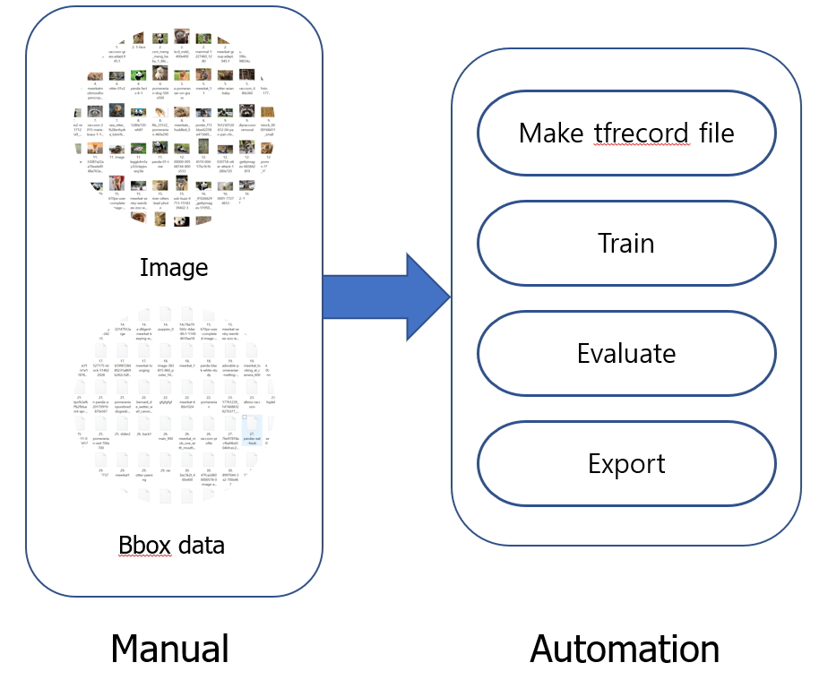
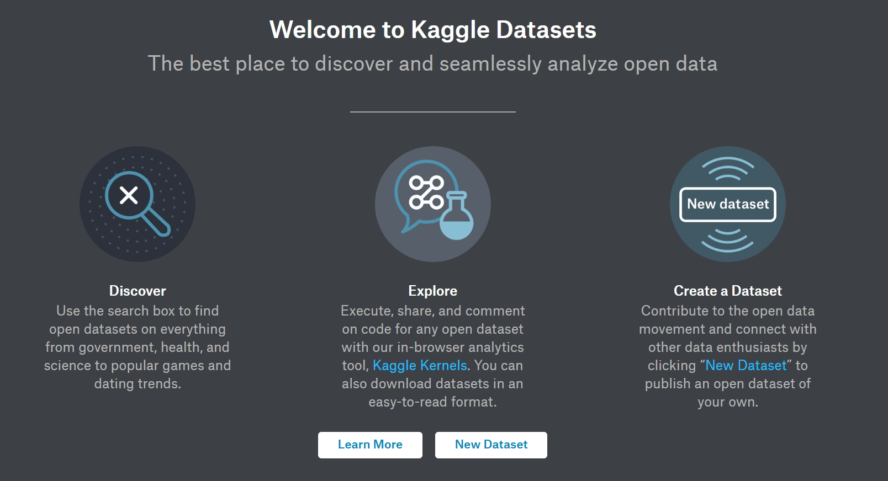
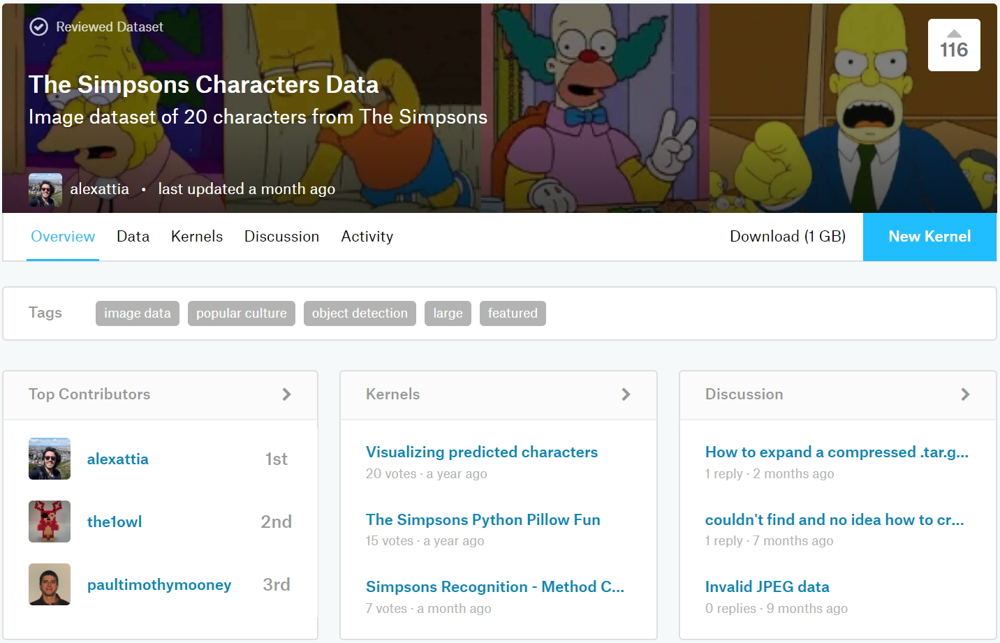
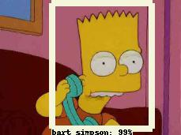

# **Object Detection with Tensorflow Helper Tool**

# Table of contents

1. [Intro](#intro)
2. [Compatibility](#compatibility)
3. [Preperation](#preperation)
4. [Tfrecord Generator](#tfgenerator)
5. [Re-training Automation Tool](#retraining)
6. [Tutorial](#tutorial)
    1) [Custom Object Detection](#customobjectdetection)
    2) [External Dataset Object Detection](#simpsonobjectdetection)

## Intro 

 

 

Tensorflow object detection api is an api for obejct detection provided by Google.  
However, the tensorflow object detection api is not easy to use for the first time users.  
This tensorflow object detection helper tool uses the object detection api to create a tf record and automatically perform train, evaluate, and export.  
You just need to collect images and prepare boundary box data!!!    
The rest is handled automatically by the helper tool.  

Tensorflow object detection api는 구글에서 제공하는 obejct detection 을 위한 api입니다.  
하지만 tensorflow object detection api는 처음 접하는 사용자들이 바로 사용하기 쉽지 않습니다.  
이 tensorflow object detection helper tool은 object detection api를 활용하여, tf record 를 생성하고, train, evaluate, export를 자동으로 수행하여 줍니다.  
여러분은 단지 이미지를 수집하고, boundary box data를 준비하시기만 하면 됩니다!!!
나머지는 helper tool이 자동으로 처리하여 줍니다.  

Main Function:
>1. Create tfrecord file
>2. Training Automation
>3. Active Learning Assistant ( Not yet )

주요 기능:
>1. tfrecord 파일 생성
>2. Training 자동화
>3. Active Learning Assistant ( Not yet )

## Compatibility 

It is compatible with Python 2.x, 3.x.  
However, the internal subprocess command is called with the 'python' command.  
Therefore, if you use python3, you must use alias.  

파이썬 2.x , 3.x 호환됩니다.  
하지만 내부 subprocess 명령어는 'python' 명령어로 호출됩니다.  
따라서 python3 를 사용할 경우, alias 를 사용하셔야 합니다.

1. In the ~ / .bashrc file, type the following: (~/.bashrc 파일에 아래 내용을 입력합니다.)  

    alias python=python3

2. Run the following command from the command line: (커맨드 라인에서 다음 명령어를 실행합니다.)  

    source ~/.bashrc
    
For example

    $ python --version
    Python 2.7.6
    $ python3 --version
    Python 3.4.3
    $ alias python=python3
    $ python --version
    Python 3.4.3

## Preperation 

### Dependencies

>1. Install tensorflow. (In case of object detection api, gpu version is recommended because parameter value of model is very large.)
>2. Refer to [tensorflow object detection installation] (https://github.com/tensorflow/models/blob/master/research/object_detection/g3doc/installation.md) to install the object detection api.

>1. tensorflow를 설치합니다. ( object detection api의 경우 모델의 파라미터 값이 매우 크므로 gpu 버전을 추천합니다. ) 
>2. [tensorflow object detection installation](https://github.com/tensorflow/models/blob/master/research/object_detection/g3doc/installation.md)을 참조하여 object detection api를 설치합니다.

    git clone https://github.com/tensorflow/models
  
  a. The libraries in the dependencies section of the page should be installed.  
  b. Testing to the Installation section.  
  c. If you proceed with the above, you will have the following libraries installed.  

  a. 해당 페이지의 dependencies 부분의 라이브러리들은 설치되어 있는것이 좋습니다.   
  b. Testing the Installation 부분까지 진행되어야 합니다.  
  c. 위의 부분을 진행하면 아래의 라이브러리가 설치되어 있을것입니다.  
    
    sudo apt-get install protobuf-compiler python-pil python-lxml python-tk  
    sudo pip install Cython  
    sudo pip install jupyter  
    sudo pip install matplotlib  
    sudo pip install pillow  
    sudo pip install lxml  
    
> The following libraries are required for smooth execution of the tool.
    
>Tool 의 원활한 실행을 위하여 필요한 라이브러리는 다음과 같습니다.
 
    sudo pip install pandas  
    sudo pip install tqdm

## 1. tfrecord Generator 

Creates a tfrecord file with xml with the area position coordinates corresponding to the image file and the image file.  
Train.record, validate.record will be generated at a fixed ratio. (Shuffle all functions with Random module's Shuffle function.)  

이미지 파일과 이미지 파일에 대응되는 영역위치 좌표가 지정된 xml을 가지고, tfrecord 파일을 생성합니다.  
정해진 비율대로 train.record , validate.record 가 생성됩니다. ( Random 모듈의 Shuffle 함수로 전부 Shuffling 됩니다. )

### 사전 준비 작업

Use [Google image download] (https://github.com/hardikvasa/google-images-download) to collect the required images.  
Use [labelimg] (https://github.com/tzutalin/labelImg) to place the xml that saved the original image and object area in one folder.
(The default folder is ./images, but can be changed to an argument.)  

[Google image download](https://github.com/hardikvasa/google-images-download) 를 사용하여 필요한 이미지를 수집합니다.
[labelimg](https://github.com/tzutalin/labelImg) 를 사용하여 원본 이미지와 오브젝트 영역을 저장한 xml 을 하나의 폴더에 위치 시킵니다.  
( 기본 폴더는 ./images 이지만, argument로 변경 가능합니다.)

### Usage - Using Command Line Interface

    python tfgenerator.py [Arguments...]

### Arguments

| Argument            | Short hand | Default                | Description                                                                                                                                                                                                                                                  |
|---------------------|------------|------------------------|--------------------------------------------------------------------------------------------------------------------------------------------------------------------------------------------------------------------------------------------------------------|
| max num classes     | m          | 90                     | 최대 클래수 갯수   ( 90이 넘을 경우 수정하십시오 )                                                                                                                                                                                                           |
| input_folder        | i          | ./images/              | 이미지와 xml이 위치한 폴더입니다.                                                                                                                                                                                                                            |
| label_file          | l          | ./label_map.pbtxt      | 레이블 파일이 존재하는 위치입니다.                                                                                                                                                                                                                           |
| custom_csv          | c          | False                  | custom csv 를 사용할지 정합니다.  기본은 사용하지 않습니다.
| train_csv_output    | tc         | ./dataset/train.csv    | train cvs 파일이 생성되는 위치입니다.    train.csv 파일은 내용 확인 용도 입니다.                                                                                                                                                                              |
| validate_csv_output | vc         | ./dataset/validate.csv | validate cvs 파일이 생성되는 위치입니다.    validate.csv 파일은 내용 확인 용도 입니다.                                                                                                                                                                        |
| split_rate          | sr         | 8                      | 분할 비율을 설정합니다.    기본값은 train 80% : validate 20% 입니다.    6으로 설정할 경우, train 60% : validate 40% 입니다.  2로 설정할 경우, train 20% : validate 80% 입니다.                                                                                  |
| log_level           | lv         | INFO                   | 로그 레벨을 지정합니다.    로그 레벨의 종류는 다음과 같습니다.  [ DEBUG , INFO , WARNING , ERROR , CRITICAL ]     현재는 INFO 레벨의 로그밖에 존재하지 않습니다.   로그는 process.log 파일에서 확인할 수 있습니다.  로그는 Re-training Automation 툴과 공유합니다. |

### Example

## 2. Re-training Automation Tool

Download the pre-trained model you want and automatically transfer learn, evaluate and export.  

원하는 Pre training 된 모델을 다운로드하고, 자동으로 Transfer learning , Evaluate, Export 를 진행합니다.  

### Usage - Using Command Line Interface

    python main.py [Arguments...]

### Model zoo

* Currently, mask model is not supported.  

* 현재 mask model 은 지원하지 않습니다. 

Model name  | Speed (ms) | COCO mAP[^1] | Outputs |
| ------------ | :--------------: | :--------------: | :-------------: |
| ssd_mobilenet_v1_coco | 30 | 21 | Boxes |
| ssd_mobilenet_v2_coco | 31 | 22 | Boxes |
| ssd_inception_v2_coco | 42 | 24 | Boxes |
| faster_rcnn_inception_v2_coco | 58 | 28 | Boxes |
| faster_rcnn_resnet50_coco | 89 | 30 | Boxes |
| faster_rcnn_resnet50_lowproposals_coco | 64 |  | Boxes |
| rfcn_resnet101_coco |  92 | 30 | Boxes |
| faster_rcnn_resnet101_coco | 106 | 32 | Boxes |
| faster_rcnn_resnet101_lowproposals_coco | 82 |  | Boxes |
| faster_rcnn_inception_resnet_v2_atrous_coco | 620 | 37 | Boxes |
| faster_rcnn_inception_resnet_v2_atrous_lowproposals_coco | 241 |  | Boxes |
| faster_rcnn_nas | 1833 | 43 | Boxes |
| faster_rcnn_nas_lowproposals_coco | 540 |  | Boxes |
 
 ### Arguments

| Argument            | Short hand | Default                | Description                                                                                                                                                                                                                                                  |
|---------------------|------------|------------------------|--------------------------------------------------------------------------------------------------------------------------------------------------------------------------------------------------------------------------------------------------------------|
| label_file          | l          | ./label_map.pbtxt      | 레이블 파일이 존재하는 위치입니다.                                                                                                                                                                                                                           |
| log_level           | lv         | INFO                   | 로그 레벨을 지정합니다.    로그 레벨의 종류는 다음과 같습니다.  [ DEBUG , INFO , WARNING , ERROR , CRITICAL ]     현재는 INFO 레벨의 로그밖에 존재하지 않습니다.   로그는 process.log 파일에서 확인할 수 있습니다.  로그는 Re-training Automation 툴과 공유합니다. |
| reset               | r          | False                  | 리셋 여부를 설정 합니다.    기본적으로 learning 은 기존 러닝과 이어서 계속 진행이 됩니다.   step 이 10000 에서 종료가 되었다면, 20000으로 learning 을 다시 시작하면 10001 부터 시작합니다.   새로운 데이터셋을 교육시키려면 reset 를 True로 설정하십시오.   |
| evaluate            | e          | True                   | evaluate_number번마다 Evaluate를 할지 설정합니다  기본값은 True 입니다. |
| evaluate_number     | n          | 2000                   | 몇번마다 Evaluate 할지 결정합니다.  기본값은 2000 입니다. |

### Example  

## Tutorial  

### Custom Object Detection 

 

Most pretested models are trained with the default dataset [coco dataset] (http://cocodataset.org/).  
Therefore, data not in the coco dataset instance should be prepared for customized dataset and transfer learning.  
This tutorial shows a series of steps to collect, label, and train data to get results.  

Pretrain 되어서 제공되는 Model들은 대부분 [coco dataset](http://cocodataset.org/) 을 기본 dataset으로 training 되었습니다.
따라서 coco dataset instance 에 없는 데이터는 custom된 dataset 을 준비하여 transfer learning을 시켜야 합니다.
해당 튜토리얼은 데이터를 수집하고, 라벨링하고, 트레이닝시켜 결과값을 얻는 일련의 과정을 보여줍니다.

[Custom Object Detection](https://github.com/5taku/custom_object_detection)

### External Dataset Object Detection 

Collecting and processing the data is a very tedious task.  
If you provide an image that is box bounded from the outside, you can make a model using it.  

데이터를 수집하고 가공하는 일은 상당히 고된 작업입니다.  
만약 외부에서 box boundary 되어 있는 이미지를 제공한다면 이를 활용하여 모델을 만들수 있습니다.  

[Kaggle](https://www.kaggle.com/)은 양질의 데이터셋을 구할 수 있는 좋은 사이트입니다.

 

[Kaggle] (https://www.kaggle.com/) is a good place to get good datasets.  

Kaggle 의 [The Simpsons Characters Data](https://www.kaggle.com/alexattia/the-simpsons-characters-dataset)를 활용하여 Object Detection 모델을 만드는 튜토리얼 입니다.

 

 
 

 
 

[The Simpson Charactors Object Detection](https://github.com/5taku/simpson_charactors_object_detection)
