# **Object Detection with Tensorflow Helper Tool**

## Summary

[Tensorflow Object Detection API](https://github.com/tensorflow/models/tree/master/research/object_detection) 는 처음 접한 사용자는 사용하기 난해하여, 좀더 쉽게 Custom object detection을 수행할 수 있는 Tool을 만들었습니다.  
This is Helper Tool for Google Tensorflow Object Detection API.

주요 기능:
>1. Create tfrecord file
>2. Re-training Automation
>3. Active Learning Assistant ( Not yet )

## Compatibility

파이썬 2.x , 3.x 호환됩니다.

하지만 내부 subprocess 명령어는 'python' 명령어로 호출됩니다.

따라서 python3 를 사용할 경우, alias 를 사용하셔야 합니다.

1. ~/.bashrc 파일에 아래 내용을 입력합니다.

    alias python=python3

2. 커맨드 라인에서 다음 명령어를 실행합니다.

    source ~/.bashrc
    
For example

    $ python --version
    Python 2.7.6
    $ python3 --version
    Python 3.4.3
    $ alias python=python3
    $ python --version
    Python 3.4.3

## Preperation

### Dependencies

>1. tensorflow를 설치합니다. ( object detection api의 경우 모델의 파라미터 값이 매우 크므로 gpu 버전을 추천합니다. ) 
>2. [tensorflow object detection installation](https://github.com/tensorflow/models/blob/master/research/object_detection/g3doc/installation.md)을 참조하여 object detection api를 설치합니다.

    git clone https://github.com/tensorflow/models
  
  a. 해당 페이지의 dependencies 부분의 라이브러리들은 설치되어 있는것이 좋습니다.   
  
  b. Testing the Installation 부분까지 진행되어야 합니다.
    
  c. 위의 부분을 진행하면 아래의 라이브러리가 설치되어 있을것입니다.  
    
    sudo apt-get install protobuf-compiler python-pil python-lxml python-tk  
    sudo pip install Cython  
    sudo pip install jupyter  
    sudo pip install matplotlib  
    sudo pip install pillow  
    sudo pip install lxml  
    
>Tool 의 원활한 실행을 위하여 필요한 라이브러리는 다음과 같습니다.   
 
    sudo pip install pandas  
    sudo pip install tqdm

## tfrecord Generator

이미지 파일과 이미지 파일에 대응되는 영역위치 좌표가 지정된 xml을 가지고, tfrecord 파일을 생성합니다.  
정해진 비율대로 train.record , validate.record 가 생성됩니다. ( Random 모듈의 Shuffle 함수로 전부 Shuffling 됩니다. )

### 사전 준비 작업

[Google image download](https://github.com/hardikvasa/google-images-download) 를 사용하여 필요한 이미지를 수집합니다.

[labelimg](https://github.com/tzutalin/labelImg) 를 사용하여 원본 이미지와 오브젝트 영역을 저장한 xml 을 하나의 폴더에 위치 시킵니다.  
( 기본 폴더는 ./images 이지만, argument로 변경 가능합니다.)

### Usage - Using Command Line Interface

    python tfgenerator.py [Arguments...]

### Arguments

| Argument            | Short hand | Default                | Description                                                                                                                                                                                                                                                  |
|---------------------|------------|------------------------|--------------------------------------------------------------------------------------------------------------------------------------------------------------------------------------------------------------------------------------------------------------|
| max num classes     | m          | 90                     | 최대 클래수 갯수   ( 90이 넘을 경우 수정하십시오 )                                                                                                                                                                                                           |
| input_folder        | i          | ./images/              | 이미지와 xml이 위치한 폴더입니다.                                                                                                                                                                                                                            |
| label_file          | l          | ./label_map.pbtxt      | 레이블 파일이 존재하는 위치입니다.                                                                                                                                                                                                                           |
| train_csv_output    | tc         | ./dataset/train.csv    | train cvs 파일이 생성되는 위치입니다.    train.csv 파일은 내용 확인 용도 입니다.                                                                                                                                                                              |
| validate_csv_output | vc         | ./dataset/validate.csv | validate cvs 파일이 생성되는 위치입니다.    validate.csv 파일은 내용 확인 용도 입니다.                                                                                                                                                                        |
| split_rate          | sr         | 8                      | 분할 비율을 설정합니다.    기본값은 train 80% : validate 20% 입니다.    6으로 설정할 경우, train 60% : validate 40% 입니다.  2로 설정할 경우, train 20% : validate 80% 입니다.                                                                                  |
| log_level           | lv         | INFO                   | 로그 레벨을 지정합니다.    로그 레벨의 종류는 다음과 같습니다.  [ DEBUG , INFO , WARNING , ERROR , CRITICAL ]     현재는 INFO 레벨의 로그밖에 존재하지 않습니다.   로그는 process.log 파일에서 확인할 수 있습니다.  로그는 Re-training Automation 툴과 공유합니다. |

### Example

## Re-training Automation Tool

원하는 Pre training 된 모델을 다운로드하고, 자동으로 Transfer learning , Export 를 진행합니다.  

### Usage - Using Command Line Interface

    python main.py [Arguments...]

### Model zoo

*현재는 mask model 은 지원하지 않습니다.*  

Model name  | Speed (ms) | COCO mAP[^1] | Outputs |
| ------------ | :--------------: | :--------------: | :-------------: |
| ssd_mobilenet_v1_coco | 30 | 21 | Boxes |
| ssd_mobilenet_v2_coco | 31 | 22 | Boxes |
| ssd_inception_v2_coco | 42 | 24 | Boxes |
| faster_rcnn_inception_v2_coco | 58 | 28 | Boxes |
| faster_rcnn_resnet50_coco | 89 | 30 | Boxes |
| faster_rcnn_resnet50_lowproposals_coco | 64 |  | Boxes |
| rfcn_resnet101_coco |  92 | 30 | Boxes |
| faster_rcnn_resnet101_coco | 106 | 32 | Boxes |
| faster_rcnn_resnet101_lowproposals_coco | 82 |  | Boxes |
| faster_rcnn_inception_resnet_v2_atrous_coco | 620 | 37 | Boxes |
| faster_rcnn_inception_resnet_v2_atrous_lowproposals_coco | 241 |  | Boxes |
| faster_rcnn_nas | 1833 | 43 | Boxes |
| faster_rcnn_nas_lowproposals_coco | 540 |  | Boxes |
 
 ### Arguments

| Argument            | Short hand | Default                | Description                                                                                                                                                                                                                                                  |
|---------------------|------------|------------------------|--------------------------------------------------------------------------------------------------------------------------------------------------------------------------------------------------------------------------------------------------------------|
| label_file          | l          | ./label_map.pbtxt      | 레이블 파일이 존재하는 위치입니다.                                                                                                                                                                                                                           |
| log_level           | lv         | INFO                   | 로그 레벨을 지정합니다.    로그 레벨의 종류는 다음과 같습니다.  [ DEBUG , INFO , WARNING , ERROR , CRITICAL ]     현재는 INFO 레벨의 로그밖에 존재하지 않습니다.   로그는 process.log 파일에서 확인할 수 있습니다.  로그는 Re-training Automation 툴과 공유합니다. |
| reset               | r          | False                  | 리셋 여부를 설정 합니다.    기본적으로 learning 은 기존 러닝과 이어서 계속 진행이 됩니다.   step 이 10000 에서 종료가 되었다면, 20000으로 learning 을 다시 시작하면 10001 부터 시작합니다.   새로운 데이터셋을 교육시키려면 reset 를 True로 설정하십시오.   |
| evaluate            | e          | True                   | evaluate_number번마다 Evaluate를 할지 설정합니다  기본값은 True 입니다. |
| evaluate_number     | n          | 2000                   | 몇번마다 Evaluate 할지 결정합니다.  기본값은 2000 입니다. |

### Example  

## Tutorial  

Pretrain 되어서 제공되는 Model들은 대부분 [coco dataset](http://cocodataset.org/) 을 기본 dataset으로 training 되었습니다.
따라서 coco dataset instance 에 없는 데이터는 custom된 dataset 을 준비하여 transfer learning을 시켜야 합니다.

다음의 예제는 custom object detection을 활용하는 예제입니다.

예제는 google cloud comute engine 에서 테스트 되었으며 vm의 사양은 다음과 같습니다.

    16 vCPU
    60gb Ram
    1 x NVIDIA Tesla P100
    ubuntu 16.0.4
    python 2.7.12
    tensorflow 1.8.0
    cuda 9.0
    cudnn 7.1
    
### STEP 1. 데이터 수집  

귀여운 판다, 라쿤, 수달, 포메라니안, 미어캣을 디텍팅해보겠습니다.    
각각의 이미지를 100장씩 준비합니다.

[Google image download](https://github.com/hardikvasa/google-images-download) 를 사용하여 이미지를 다운로드 합니다. ( 저작권을 조심하시길 바라겠습니다. )  

     googleimagesdownload --keywords "panda" --size medium --output_directory ./panda  
     
위의 명령어대로 실행하면, 이미지를 폴더에 다운로드 하게 됩니다.  
적당하게 잘못된 이미지를 지우고 다른 이미지로 채워 넣습니다.

raccoon , otter , pomeranian , meerkat 역시 동일하게 이미지를 준비합니다.

오직 jpg 파일포맷의 이미지만 가능합니다.

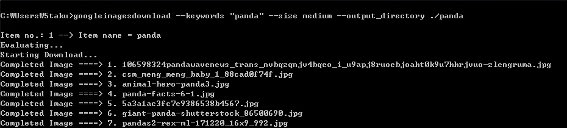  
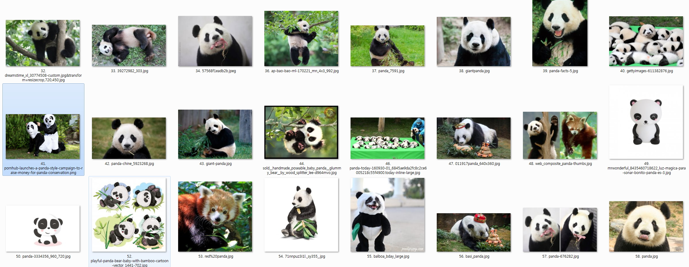  

### STEP 2. 데이터 라벨링

[labelimg](https://github.com/tzutalin/labelImg) 를 사용하여 원본 이미지와 오브젝트 영역을 저장한 xml 을 하나의 폴더에 위치 시킵니다.  
( 기본 폴더는 images 폴더입니다.)  

하나의 이미지에 여러개의 라벨이 존재할 수 있습니다.  
Tip. 각각의 Object 에서 default label을 설정하면 라벨을 하나하나 입력할 필요가 없습니다.  
Tip. 단축키 W 는 영역지정 A 는 이전 이미지 D 는 다음 이미지 Ctrl + S 는 저장입니다.  

500장의 이미지를 라벨링하는데 50분 정도의 시간이 소요되었습니다.  

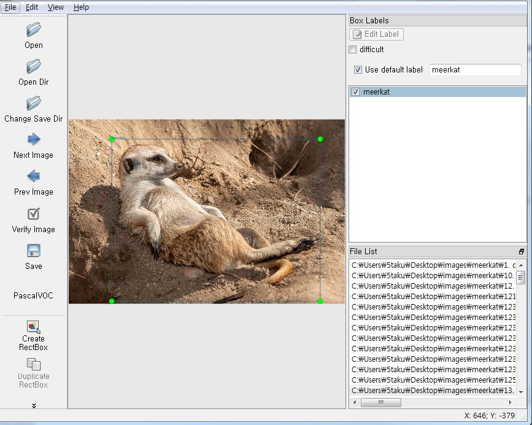  

### STEP 3. TF RECORD 파일 생성

tfgenerator.py 명령어를 수행하여, TF RECORD 파일을 생성합니다.

    python tfgenerator.py    

process.log 파일을 통하여 요약정보를 확인할 수 있습니다.

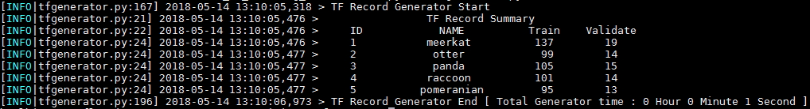  

train , validate 비율을 변경하려면, -sr 옵션을 사용하면 됩니다.

    python tfgenerator.py -sr 5
    
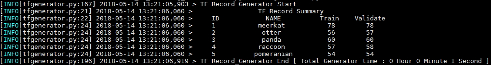      

위의 원본 이미지, xml, csv, record 파일은 [여기](https://drive.google.com/drive/folders/1WwqFT6sbgoL6n7Bq-qbcvwkVHNSztKVS?usp=sharing)에서 다운받으실 수 있습니다.  

### STEP 4. label_map.pbtxt 파일 수정

레이블과 번호를 입력하여 줍니다.

    item {
      id: 1
      name: 'meerkat'
    }
    item {
      id: 2
      name: 'otter'
    }
    item {
      id: 3
      name: 'panda'
    }
    item {
      id: 4
      name: 'raccoon'
    }
    item {
      id: 5
      name: 'pomeranian'
    }

### STEP 5. Transfer Learning & exporting

Faster_Rcnn_Inception_v2_coco 모델을 가지고 50,000번 training 시켜보겠습니다.  
3,000번마다 evaluate 값을 확인하겠습니다.

    python main.py -n 3000

 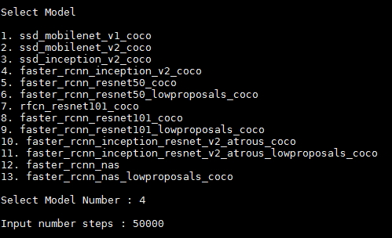     
 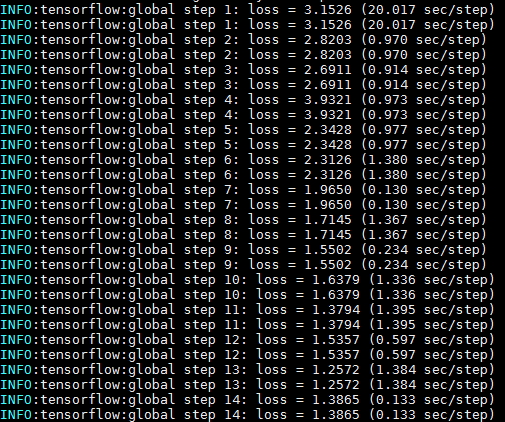     
 
 ### STEP 6. Export model 확인
 
 export_dir 폴더로 이동합니다.
 
    ./export_dir/faster_rcnn_inception_v2_coco_2018_01_28 
 
 frozen_inference_graph.pb 파일이 존재하는지 확인합니다.
 
 ### 번외0. 테스트 이미지 확인
 
 테스트 이미지 폴더에 적절한 이미지들을 넣습니다.  
 기본 테스트 이미지 폴더는 아래와 같습니다.  
 (image0.jpg 부터 시작하여 번호를 증가시킵니다.)  
 
     ./object_detection/test_images
 
 jupyter notebook을 실행합니다.
 
 object detection 튜토리얼 파일을 수행합니다. 
 
     ./object_detection/object_detection_tutorial.ipynb
     
 결과값을 확인합니다.  
 
  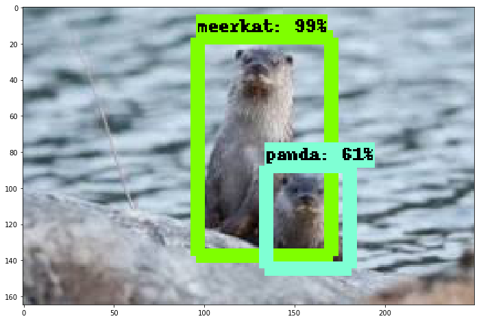   
  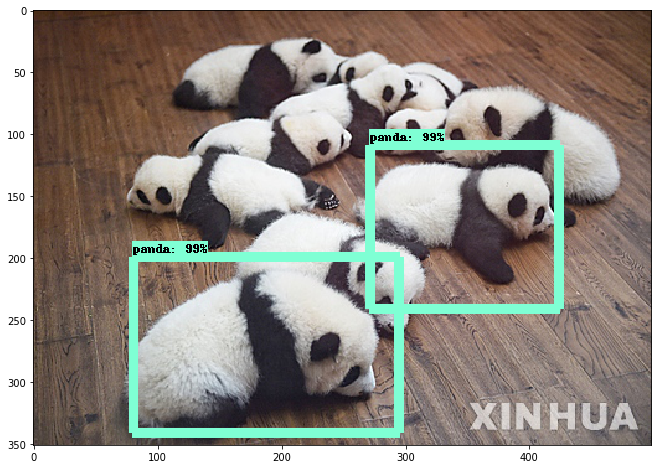   
  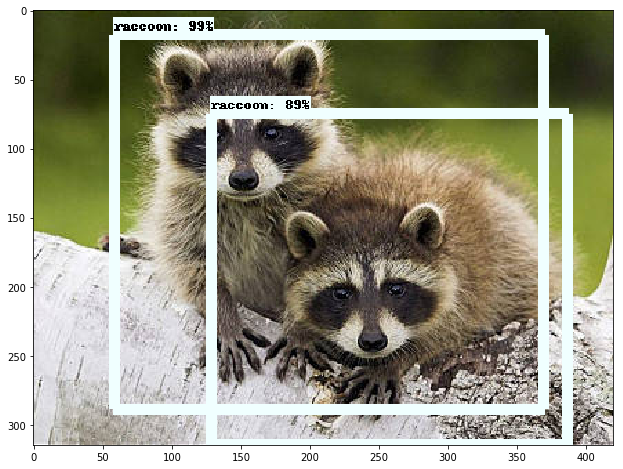   
  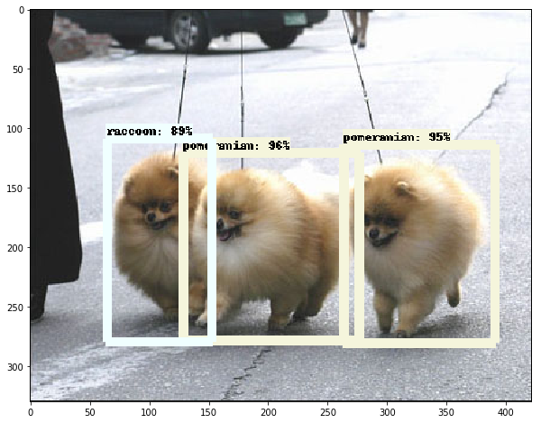   
  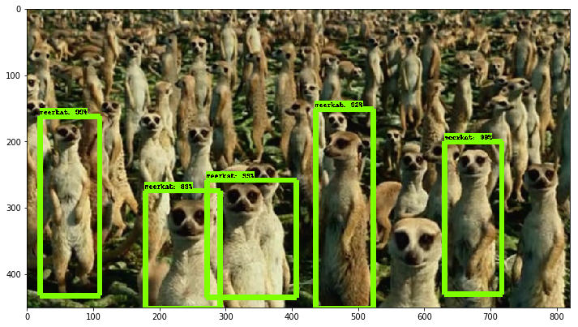         
 
 위의 결과를 보면, 정확한 결과값을 내지 못하는 경우도 있습니다.  
 이 경우, 모델의 변경, dataset 의 추가, training_step의 증가, hyperparameter 변경등을 통하여 정확도를 향상시킬 수 있습니다.  
 
 ### 번외1. evaluate 값 확인
 
 eval_dir 폴더로 이동합니다.
 
     ./eval_dir/faster_rcnn_inception_v2_coco_2018_01_28 
     
 tensorboard를 실행합니다.
 
     $tensorboard --logdir=./
     
 각 이미지들을 확인합니다.
 
  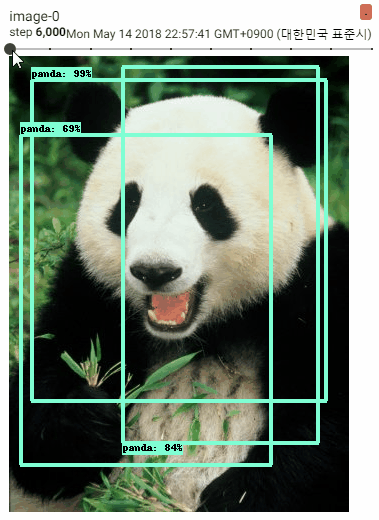      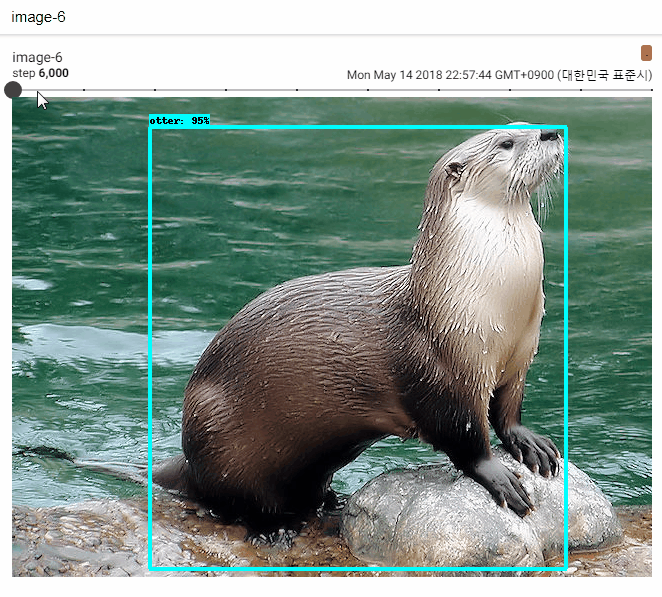     
 
 ### 번외2. loss 값 확인
 
 train_dir 폴더로 이동합니다.   
 
     ./train_dir/faster_rcnn_inception_v2_coco_2018_01_28 
 
  tensorboard를 실행합니다.
 
     $tensorboard --logdir=./
    
   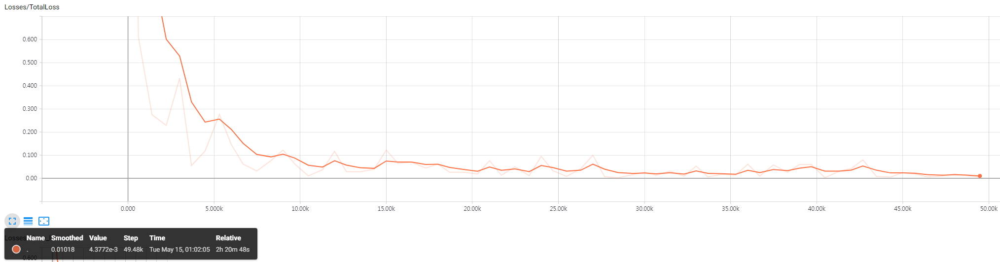 